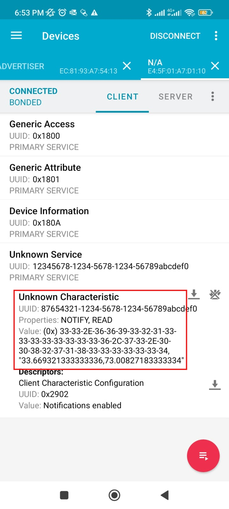

## How to Run the Code
1. Unzip the .zip file.
2. Change directory to the folder containing the files by entering this command `cd RPI_GPS_BLE`
3. Type in the Terminal `bluetoothctl`
4. Power on the Bluetooth by entering `power on`
5. Make the Bluetooth Pairable by entering `pairable on`
6. Turn on advertisement by entering `advertise on`
7. Make the Bluetooth Discoverable by entering `discoverable on`
8. Exit the `bluetoothctl` menu by entering `exit`
9. Activate the virtual environment by entering `source venv/bin/activate`
10. Run the Code by entering `python main.py`
11. Pair to the Bluetooth using phone
12. Download NRFConnect app.
13. Open the App and connect to the Bluetooth device you paired.
14. Click on the `Unknown Service` with UUID starting from `12345678`                                             

15. Then Click on the `Unknown Characteristics` with UUID starting from `87654321`                                                         

16. Then Click on the `Arrow Down` Icon to read the GPS Data                                                                           
